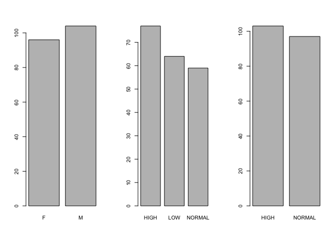

Drug_Classification
================
Hanyu Chen
2023-02-08

``` r
#install.packages("caret")
library("caret")
```

    ## Warning: package 'caret' was built under R version 4.1.2

    ## Loading required package: ggplot2

    ## Warning: package 'ggplot2' was built under R version 4.1.2

    ## Loading required package: lattice

``` r
data<- read.csv("drug200.csv")
summary(data)
```

    ##       Age            Sex                 BP            Cholesterol       
    ##  Min.   :15.00   Length:200         Length:200         Length:200        
    ##  1st Qu.:31.00   Class :character   Class :character   Class :character  
    ##  Median :45.00   Mode  :character   Mode  :character   Mode  :character  
    ##  Mean   :44.31                                                           
    ##  3rd Qu.:58.00                                                           
    ##  Max.   :74.00                                                           
    ##     Na_to_K           Drug          
    ##  Min.   : 6.269   Length:200        
    ##  1st Qu.:10.445   Class :character  
    ##  Median :13.937   Mode  :character  
    ##  Mean   :16.084                     
    ##  3rd Qu.:19.380                     
    ##  Max.   :38.247

``` r
which(is.na(data)) # no missing value
```

    ## integer(0)

``` r
dim(data) # shape of (162,6)
```

    ## [1] 200   6

``` r
sapply(data,class) # check the data type of each column
```

    ##         Age         Sex          BP Cholesterol     Na_to_K        Drug 
    ##   "integer" "character" "character" "character"   "numeric" "character"

``` r
head(data)
```

    ##   Age Sex     BP Cholesterol Na_to_K  Drug
    ## 1  23   F   HIGH        HIGH  25.355 DrugY
    ## 2  47   M    LOW        HIGH  13.093 drugC
    ## 3  47   M    LOW        HIGH  10.114 drugC
    ## 4  28   F NORMAL        HIGH   7.798 drugX
    ## 5  61   F    LOW        HIGH  18.043 DrugY
    ## 6  22   F NORMAL        HIGH   8.607 drugX

``` r
data$Drug <-factor(data$Drug)
data$BP <- factor (data$BP)
data$Cholesterol <- factor(data$Cholesterol)
data$Sex <- factor(data$Sex)
summary(data)
```

    ##       Age        Sex          BP     Cholesterol     Na_to_K          Drug   
    ##  Min.   :15.00   F: 96   HIGH  :77   HIGH  :103   Min.   : 6.269   drugA:23  
    ##  1st Qu.:31.00   M:104   LOW   :64   NORMAL: 97   1st Qu.:10.445   drugB:16  
    ##  Median :45.00           NORMAL:59                Median :13.937   drugC:16  
    ##  Mean   :44.31                                    Mean   :16.084   drugX:54  
    ##  3rd Qu.:58.00                                    3rd Qu.:19.380   DrugY:91  
    ##  Max.   :74.00                                    Max.   :38.247

Visulization

``` r
# Identify x and y
x <- data[,1:5]
y <- data[,6]
# boxplots to see distribution
par(mfrow = c(1:2))
boxplot(x$Age)
boxplot(x$Na_to_K)
```

<!-- -->

``` r
par(mfrow=c(1,3))
title <- c("Sex","BP","Cholesterol")
  for (i in x){
    if (class(i) =="factor"){
      barplot(table(i))
  }
  }
```

<!-- -->

``` r
#install.packages("fastDummies")
library("fastDummies")
data <- dummy_cols(data, select_columns = c("Sex","Cholesterol","BP"))
data <- subset(data,select = -c(Sex, Cholesterol, BP))
```

``` r
# Randomly create a list of 80% of the index that used for training
validation_index <- createDataPartition(data$Drug, p = 0.80, list = FALSE)
# 20% of the data used for validation
validation <- data[-validation_index,]
# 80% used to train and test
data<- data[validation_index,]
```

``` r
control <- trainControl(method = 'cv',
                        summaryFunction = defaultSummary,
                        number = 10,
                        savePredictions = TRUE)
metric <- 'Accuracy'
```

Build Models

``` r
set.seed(37)
knn_m <- train(Drug~., 
               data = data,
               method = "knn", 
               metric = metric, 
               trControl = control,
               tuneGrid = data.frame(k = seq(10,30,by = 1))) # Cross-Validation)
knn_m
```

    ## k-Nearest Neighbors 
    ## 
    ## 162 samples
    ##   9 predictor
    ##   5 classes: 'drugA', 'drugB', 'drugC', 'drugX', 'DrugY' 
    ## 
    ## No pre-processing
    ## Resampling: Cross-Validated (10 fold) 
    ## Summary of sample sizes: 143, 146, 145, 145, 147, 146, ... 
    ## Resampling results across tuning parameters:
    ## 
    ##   k   Accuracy   Kappa    
    ##   10  0.6641809  0.5091741
    ##   11  0.6539177  0.4993421
    ##   12  0.6223671  0.4454458
    ##   13  0.6836107  0.5330152
    ##   14  0.6536662  0.4858557
    ##   15  0.6468344  0.4763758
    ##   16  0.6550697  0.4802587
    ##   17  0.6373065  0.4501089
    ##   18  0.6551187  0.4795964
    ##   19  0.6548671  0.4764614
    ##   20  0.6603818  0.4824121
    ##   21  0.6904799  0.5233680
    ##   22  0.6779799  0.5078431
    ##   23  0.6657985  0.4889400
    ##   24  0.6665828  0.4893022
    ##   25  0.6783475  0.5052824
    ##   26  0.6904799  0.5257657
    ##   27  0.6720975  0.4973818
    ##   28  0.6532985  0.4654664
    ##   29  0.6599162  0.4801954
    ##   30  0.6669995  0.4905707
    ## 
    ## Accuracy was used to select the optimal model using the largest value.
    ## The final value used for the model was k = 26.

``` r
set.seed(37)
glm_m <- train(Drug~., 
               data = data,
               method = "glmnet", 
               metric = metric, 
               trControl = control
              )
glm_m
```

    ## glmnet 
    ## 
    ## 162 samples
    ##   9 predictor
    ##   5 classes: 'drugA', 'drugB', 'drugC', 'drugX', 'DrugY' 
    ## 
    ## No pre-processing
    ## Resampling: Cross-Validated (10 fold) 
    ## Summary of sample sizes: 143, 146, 145, 145, 147, 146, ... 
    ## Resampling results across tuning parameters:
    ## 
    ##   alpha  lambda        Accuracy   Kappa    
    ##   0.10   0.0007982258  0.9579721  0.9401211
    ##   0.10   0.0079822582  0.9576045  0.9396035
    ##   0.10   0.0798225820  0.9202580  0.8829747
    ##   0.55   0.0007982258  0.9579721  0.9401211
    ##   0.55   0.0079822582  0.9576045  0.9396035
    ##   0.55   0.0798225820  0.8395356  0.7569180
    ##   1.00   0.0007982258  0.9693202  0.9564352
    ##   1.00   0.0079822582  0.9697368  0.9570991
    ##   1.00   0.0798225820  0.7970911  0.6903687
    ## 
    ## Accuracy was used to select the optimal model using the largest value.
    ## The final values used for the model were alpha = 1 and lambda = 0.007982258.

``` r
plot(glm_m)
```

<!-- -->

``` r
set.seed(37)
rf_m <- train(Drug~., 
               data = data,
               method = "rf", 
               metric = metric, 
               trControl = control,
              tuneLength = 30
              )
```

    ## note: only 8 unique complexity parameters in default grid. Truncating the grid to 8 .

``` r
# mtry = 3 
print(rf_m)
```

    ## Random Forest 
    ## 
    ## 162 samples
    ##   9 predictor
    ##   5 classes: 'drugA', 'drugB', 'drugC', 'drugX', 'DrugY' 
    ## 
    ## No pre-processing
    ## Resampling: Cross-Validated (10 fold) 
    ## Summary of sample sizes: 143, 146, 145, 145, 147, 146, ... 
    ## Resampling results across tuning parameters:
    ## 
    ##   mtry  Accuracy  Kappa    
    ##   2     0.99375   0.9911602
    ##   3     0.99375   0.9911602
    ##   4     1.00000   1.0000000
    ##   5     1.00000   1.0000000
    ##   6     1.00000   1.0000000
    ##   7     1.00000   1.0000000
    ##   8     1.00000   1.0000000
    ##   9     1.00000   1.0000000
    ## 
    ## Accuracy was used to select the optimal model using the largest value.
    ## The final value used for the model was mtry = 4.

``` r
plot(rf_m)
```

<!-- -->

``` r
results <- resamples (list(knn = knn_m, rf = rf_m, glm = glm_m))
print(summary(results))
```

    ## 
    ## Call:
    ## summary.resamples(object = results)
    ## 
    ## Models: knn, rf, glm 
    ## Number of resamples: 10 
    ## 
    ## Accuracy 
    ##      Min.   1st Qu. Median      Mean   3rd Qu.      Max. NA's
    ## knn 0.600 0.6710526 0.6875 0.6904799 0.7264706 0.7647059    0
    ## rf  1.000 1.0000000 1.0000 1.0000000 1.0000000 1.0000000    0
    ## glm 0.875 0.9399671 1.0000 0.9697368 1.0000000 1.0000000    0
    ## 
    ## Kappa 
    ##          Min.   1st Qu.    Median      Mean   3rd Qu.      Max. NA's
    ## knn 0.4181818 0.5045181 0.5219853 0.5257657 0.5750661 0.6158192    0
    ## rf  1.0000000 1.0000000 1.0000000 1.0000000 1.0000000 1.0000000    0
    ## glm 0.8181818 0.9177680 1.0000000 0.9570991 1.0000000 1.0000000    0

``` r
dotplot(results) # Random Forest is the best
```

<!-- -->

``` r
pred <- predict(rf_m, validation)
confusionMatrix(pred,validation$Drug)
```

    ## Confusion Matrix and Statistics
    ## 
    ##           Reference
    ## Prediction drugA drugB drugC drugX DrugY
    ##      drugA     4     2     0     0     0
    ##      drugB     0     1     0     0     0
    ##      drugC     0     0     3     0     0
    ##      drugX     0     0     0     9     0
    ##      DrugY     0     0     0     1    18
    ## 
    ## Overall Statistics
    ##                                           
    ##                Accuracy : 0.9211          
    ##                  95% CI : (0.7862, 0.9834)
    ##     No Information Rate : 0.4737          
    ##     P-Value [Acc > NIR] : 5.82e-09        
    ##                                           
    ##                   Kappa : 0.8832          
    ##                                           
    ##  Mcnemar's Test P-Value : NA              
    ## 
    ## Statistics by Class:
    ## 
    ##                      Class: drugA Class: drugB Class: drugC Class: drugX
    ## Sensitivity                1.0000      0.33333      1.00000       0.9000
    ## Specificity                0.9412      1.00000      1.00000       1.0000
    ## Pos Pred Value             0.6667      1.00000      1.00000       1.0000
    ## Neg Pred Value             1.0000      0.94595      1.00000       0.9655
    ## Prevalence                 0.1053      0.07895      0.07895       0.2632
    ## Detection Rate             0.1053      0.02632      0.07895       0.2368
    ## Detection Prevalence       0.1579      0.02632      0.07895       0.2368
    ## Balanced Accuracy          0.9706      0.66667      1.00000       0.9500
    ##                      Class: DrugY
    ## Sensitivity                1.0000
    ## Specificity                0.9500
    ## Pos Pred Value             0.9474
    ## Neg Pred Value             1.0000
    ## Prevalence                 0.4737
    ## Detection Rate             0.4737
    ## Detection Prevalence       0.5000
    ## Balanced Accuracy          0.9750

Random Forest model gets an accuracy of 0.975
